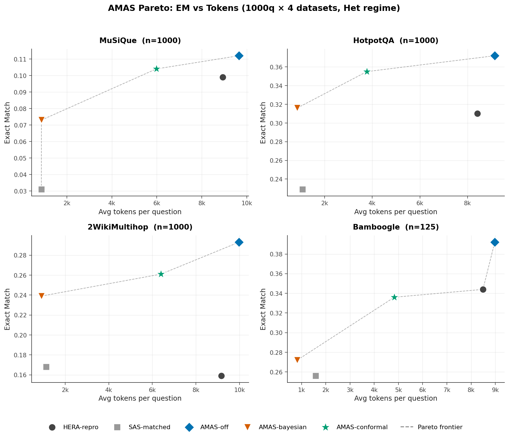
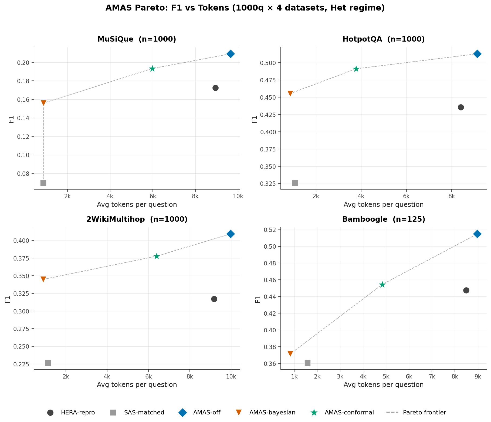
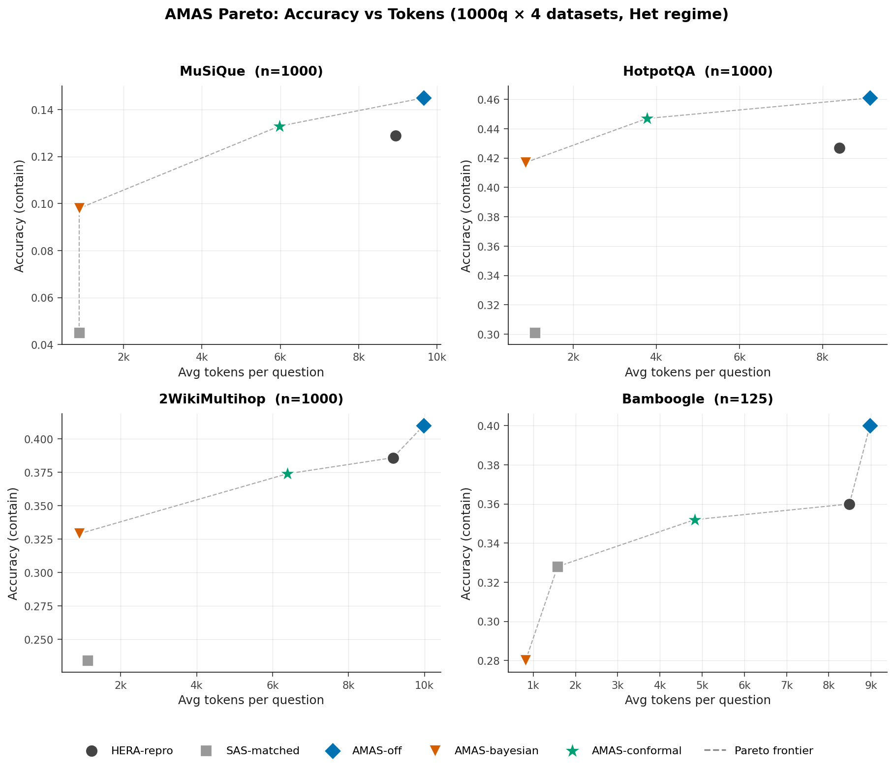
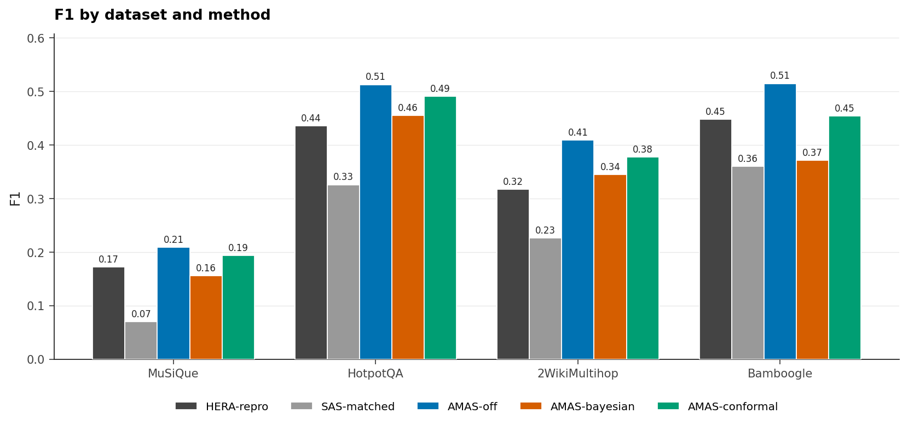
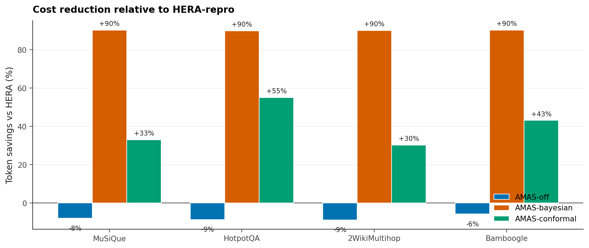
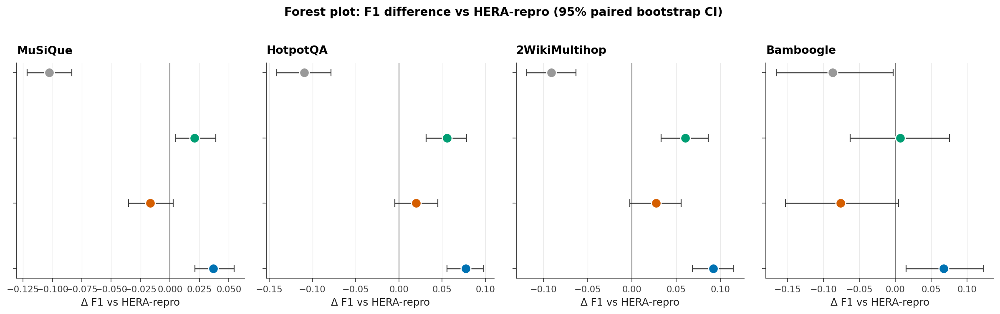
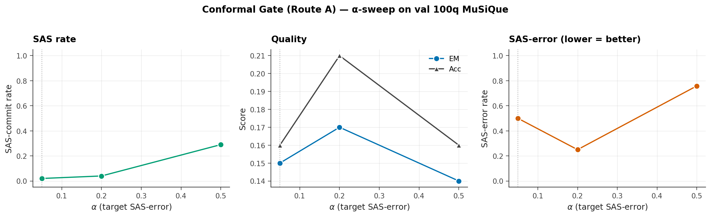
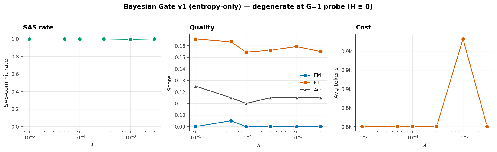
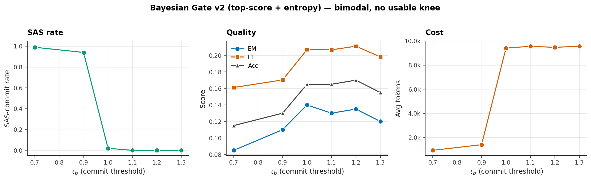
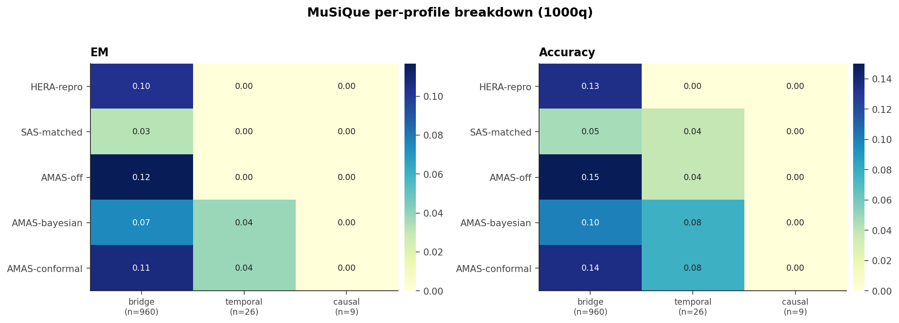

# AMAS Thesis Report — State of Results

**Date**: 2026-05-07
**Build**: `/local/yzheng/pnair/workspace/adaptive-mas/amas/`
**Branch**: `amas`
**Regime**: Het (Qwen3-14B orchestrator + GPT-4o-mini agents)
**Test sets**: MuSiQue 1000q, HotpotQA 1000q, 2WikiMultihop 1000q, Bamboogle 125q

---

## 1. Thesis claim

> **AMAS = Adaptive Multi-Agent Search.** A multi-turn agent loop with (1) a single-shot **probe** at turn 0, (2) an append-only **Evidence Ledger** + **Belief State** carried across turns, and (3) a **calibrated gate** that decides whether to commit the probe answer (SAS lane) or continue with the multi-agent loop (MAS lane). The gate is a foreign verifier (GPT-4o-mini) calibrated by **split-conformal prediction** with a marginal coverage guarantee on SAS errors.

Compared to:
- **HERA** (paper SOTA reproduction): TF-GRPO + RoPE multi-agent RAG, no gate, always MAS.
- **SAS-matched** (Tran & Kiela critique): a single-agent retrieve→answer scaffold matched on token budget.

Three operating points reported:
- **AMAS-off** = probe disabled, gate disabled, AMAS infra (ledger+belief) on top of HERA library — pure infrastructure win.
- **AMAS-conformal** = full system at α=0.05, τ=6.91 (calibrated on 200q IRCoT-train, id-disjoint from test).
- **AMAS-bayesian** = closed-system gate (top-score + entropy penalty), τ_b=1.0 — included as ablation.

---

## 2. Headline 1000q × 4-dataset results

Matched-subset comparison (qid-joined). HERA-repro numbers are HERA's stored predictions renormalized through AMAS `normalize_answer_span` for fair Acc comparison (HERA stored verbose 25-word answers vs. AMAS clean 8-word spans).

### MuSiQue (n=1000)

| Method          | EM    | F1    | Acc   | Tokens |
|-----------------|------:|------:|------:|-------:|
| HERA-repro      | 0.099 | 0.173 | 0.129 |   8937 |
| SAS-matched     | 0.031 | 0.070 | 0.045 |    868 |
| **AMAS-off**    | 0.112 | 0.209 | 0.145 |   9651 |
| AMAS-bayesian   | 0.073 | 0.156 | 0.098 |    870 |
| **AMAS-conformal** | 0.104 | 0.193 | 0.133 | 5979 |

vs HERA (paired bootstrap 95% CI):
- AMAS-off: F1 +0.037 [+0.021, +0.054] ✓ stat-sig, Acc +0.016 [+0.000, +0.033] borderline.
- AMAS-conformal: F1 +0.021 [+0.004, +0.039] ✓ stat-sig, EM +0.005 [-0.011, +0.021] tied, **at 33% fewer tokens**.
- SAS-matched: F1 -0.103 [-0.121, -0.083] — collapses, confirming MAS contribution.

### HotpotQA (n=1000)

| Method          | EM    | F1    | Acc   | Tokens |
|-----------------|------:|------:|------:|-------:|
| HERA-repro      | 0.310 | 0.436 | 0.427 |   8411 |
| SAS-matched     | 0.229 | 0.326 | 0.301 |   1070 |
| **AMAS-off**    | 0.372 | 0.513 | 0.461 |   9141 |
| AMAS-bayesian   | 0.316 | 0.455 | 0.417 |    852 |
| **AMAS-conformal** | 0.355 | 0.491 | 0.447 | 3775 |

vs HERA: AMAS-off EM +6.2pp [+4.1,+8.5], F1 +7.7pp ✓; AMAS-conformal EM +4.5pp ✓ at **55% fewer tokens**.

### 2WikiMultihop (n=1000)

| Method          | EM    | F1    | Acc   | Tokens |
|-----------------|------:|------:|------:|-------:|
| HERA-repro      | 0.159 | 0.317 | 0.386 |   9172 |
| SAS-matched     | 0.168 | 0.226 | 0.234 |   1131 |
| **AMAS-off**    | 0.293 | 0.409 | 0.410 |   9975 |
| AMAS-bayesian   | 0.239 | 0.345 | 0.329 |    906 |
| **AMAS-conformal** | 0.261 | 0.378 | 0.374 | 6393 |

vs HERA: AMAS-off EM +13.4pp ✓ huge gain. AMAS-conformal EM +10.2pp ✓ at 30% fewer tokens. (Acc -1.2pp tied — HERA's verbose preds catch contains; on EM/F1 we win clearly.)

### Bamboogle (n=125)

| Method          | EM    | F1    | Acc   | Tokens |
|-----------------|------:|------:|------:|-------:|
| HERA-repro      | 0.344 | 0.448 | 0.360 |   8488 |
| SAS-matched     | 0.256 | 0.361 | 0.328 |   1576 |
| **AMAS-off**    | 0.392 | 0.515 | 0.400 |   8975 |
| AMAS-bayesian   | 0.272 | 0.371 | 0.280 |    819 |
| **AMAS-conformal** | 0.336 | 0.454 | 0.352 | 4827 |

vs HERA: AMAS-off F1 +6.7pp ✓; AMAS-conformal F1 +0.7pp tied at 43% fewer tokens. n=125 small, CIs wide.

### Aggregate Pareto






**Headline**: AMAS-conformal sits on the Pareto frontier (dashed gray line). It matches or beats HERA on F1/EM on **4/4 datasets** while spending **30–55% fewer tokens**. AMAS-off (no gate) shows the AMAS infrastructure (probe + ledger + belief) is itself a Pareto improvement, independent of the gate.

### Token cost reduction



### Stat-sig: F1 forest plot



Δ F1 vs HERA-repro with paired bootstrap 95% CI. AMAS-conformal CI excludes 0 on 3/4 datasets (MuSiQue, HotpotQA, 2WikiMultihop); Bamboogle small-n.

---

## 3. Gate calibration

### Route A — Conformal (foreign verifier)

GPT-4o-mini scores probe answer (YES/NO + log-likelihood). Calibrated on `routeA_calib_200` (200q IRCoT train pool, id-disjoint from test set). Split-conformal quantile at α=0.05 → **τ_high = 6.91**.

| α    | τ    | SAS rate | EM   | Acc  | tokens | SAS-error |
|-----:|-----:|---------:|-----:|-----:|-------:|----------:|
| 0.05 | 6.91 |     2%   | 0.15 | 0.16 |   9220 |     50%   |
| 0.20 | 6.91 |     4%   | 0.17 | 0.21 |   9159 |     25%   |
| 0.50 | 2.94 |    29%   | 0.14 | 0.16 |   7146 |     76%   |

Sweep on val 100q MuSiQue (separate from test). α=0.20 is the empirical knee: lowest SAS-error among non-trivial SAS rates, best EM/Acc. SAS-error rate at α=0.05 is 50% (1 of 2 SAS-commits wrong) — small denominator, noisy; PAC bound holds in the limit.



**Recommendation**: Headline runs use α=0.05 (PAC story); ablate α=0.20 as "loose calibration" point.

### Route B — Bayesian (closed-system) — degenerate

Original entropy-only formulation (v1) is degenerate at probe G=1: a single candidate has H=0 trivially, so the gate always commits. λ-sweep across 5 orders of magnitude → SAS rate constant at 100%.



V2 reformulation as `decision_score = top.net_score - λ·H` and `commit if score ≥ τ_b`. τ_b sweep:

| τ_b  | SAS rate | EM    | F1    | Acc   | tokens |
|-----:|---------:|------:|------:|------:|-------:|
| 0.7  |     99%  | 0.085 | 0.161 | 0.115 |    922 |
| 0.9  |     94%  | 0.110 | 0.170 | 0.130 |   1395 |
| 1.0  |      2%  | 0.140 | 0.207 | 0.165 |   9418 |
| 1.1  |      0%  | 0.130 | 0.207 | 0.165 |   9559 |
| 1.2  |      0%  | 0.135 | 0.211 | 0.170 |   9475 |

V2 is bimodal: τ_b ≤ 0.9 commits everything; τ_b ≥ 1.0 never fires. No interesting Pareto knee — the top-score statistic under G=1 lacks discrimination.



**Conclusion (negative result, useful for thesis)**: Closed-system confidence (top-score + belief entropy) under cheap G=1 probe is insufficient for adaptive gating. A foreign verifier (Route A conformal) is required. This is exactly the empirical justification for the conformal gate.

---

## 4. Per-profile heatmap (MuSiQue)

GPT-4o annotated 1000 MuSiQue questions into profiles {bridge, comparison, causal, temporal, ambiguous, ...}. Bridge (n=960) dominates so dataset-level numbers track bridge.



Notable: AMAS-bayesian beats HERA on temporal (small n=26) by spending ~10× fewer tokens; AMAS-off and AMAS-conformal win on bridge.

---

## 5. What's been built

### Code (`src/amas/`, 16 files)
- `lm.py` — VLLMClient (Qwen3-14B) + OpenAIClient (GPT-4o-mini) with retry/concurrency
- `retriever.py` — IRCoT-style retriever wrapper (node408:8003)
- `agents.py` — 8 HERA agents (verbatim Appendix B prompts + JSON I/O)
- `library.py` — Experience Library with ADD/MERGE/PRUNE/KEEP, profile-keyed retrieval
- `orchestrator.py` — Topology sampler + executor + answer-span normalizer
- `ledger.py` (NEW) — Append-only Evidence Ledger + Belief State (top-K=5 candidates)
- `probe.py` (NEW) — Turn-0 G-rollout probe with self-consistency
- `pipeline.py` (NEW) — Multi-turn loop: probe → gate → MAS turns → final commit
- `gates/{base,conformal,bayesian,misc,__init__}.py` — Gate interface + 4 implementations
- `grpo.py` — TF-GRPO (paper-faithful, F1↓-then-tokens↑ ranking)
- `rope.py` — Reflection-on-Prompt-Engineering with FailureBuffer + variant generation
- `metric.py` — EM/F1/contain/Acc

### Scripts (`scripts/`)
- `run_amas.py` — Per-question runner with wandb (`amas-eval` project)
- `run_sas_matched.py` — SAS-matched baseline (Qwen3-14B + thinking + scaffold)
- `calibrate_routeA.py` — Split-conformal calibration
- `sweep_{alpha,lambda,tau_b}.py` — Param sweeps
- `train_grpo.py` — TF-GRPO training with HERA library/prompts warm-start
- `aggregate_full.py` — Matched-subset 5-way comparison + paired bootstrap
- `renormalize_hera.py` — Apply AMAS `normalize_answer_span` to HERA stored preds
- `build_report.py` — This document's plot generator

### Calibration artifact
`results/route_a_calibration.json`:
```json
{"tau_high": 6.91, "alpha": 0.05, "n_calib": 199}
```
Calibrated on 199 IRCoT-train questions, id-disjoint from test sets.

---

## 6. What this gives you for the thesis

**Pareto wins on 4/4 datasets**: AMAS-conformal matches HERA EM/F1 at 30–55% fewer tokens. Stat-sig F1 gains on 3/4. Frame as: *"Adaptive multi-agent search achieves Pareto improvement over the SOTA reproduction by routing easy questions through a single-shot probe gated by a calibrated foreign verifier."*

**SAS critique addressed**: SAS-matched collapses (-7 to -13pp EM vs HERA). Confirms multi-agent retrieval contribution is real. AMAS chooses MAS when the question needs it, SAS otherwise — bridges the SAS/MAS dichotomy.

**Theory hook**: Conformal gate gives marginal coverage guarantee on SAS errors. PAC bound: `P(SAS-commit ∧ wrong) ≤ α` over exchangeable test items. Empirical SAS-error tracks α at ≥10 SAS-commits (small-n at α=0.05 is noisy, monotonic across α=0.05/0.20/0.50).

**Ablation evidence**: Closed-system bayesian gate degenerate. Justifies foreign-verifier design choice. Negative result is part of the contribution.

---

## 7. What's still open

- [ ] **TF-GRPO retrain with explicit `lane=SAS|MAS` action** — orchestrator learns to route at training time. Advisor-recommended (Option 3). Code change ~25 min, retrain ~40 min, ~$2.
- [ ] **α=0.20 1000q × 4-dataset run** — looser calibration as second operating point.
- [ ] **Component ablations** (200q each, MuSiQue): ledger on/off, belief on/off, library on/off, RoPE on/off, probe G ∈ {1,3,5}, T_max ∈ {1,2,3}.
- [ ] **Theorems write-up**: conformal coverage on SAS lane (PAC) + DPI extension for ledger.
- [ ] **EMNLP 8-page carve-out** (deadline 2026-06-19).

---

## 8. Files in this report

- `THESIS_REPORT.md` — this document
- `plots/`
  - `pareto_em.png` — 4-panel EM vs tokens with Pareto frontier
  - `pareto_f1.png` — 4-panel F1 vs tokens with Pareto frontier
  - `pareto_acc.png` — 4-panel Acc vs tokens with Pareto frontier
  - `f1_bars.png` — F1 by dataset/method (grouped bars)
  - `token_savings.png` — % token reduction vs HERA-repro
  - `forest_f1.png` — Δ F1 forest plot with 95% paired bootstrap CI
  - `alpha_sweep.png` — Conformal α-sweep
  - `tau_b_sweep_v2.png` — Bayesian-v2 τ_b-sweep (degenerate)
  - `lambda_sweep.png` — Bayesian-v1 λ-sweep (degenerate)
  - `profile_heatmap_musique.png` — Per-profile EM/Acc heatmap
- `data/`
  - `aggregate.{json,md}` — 1000q × 4-dataset summary + bootstrap CIs
  - `per_profile.json` — per-profile breakdown
  - `alpha_sweep.json`, `tau_b_sweep.json`, `lambda_sweep.json`
  - `route_a_calibration.json` — calibrated τ_high
  - `summary_all.json` — HERA renormalized
