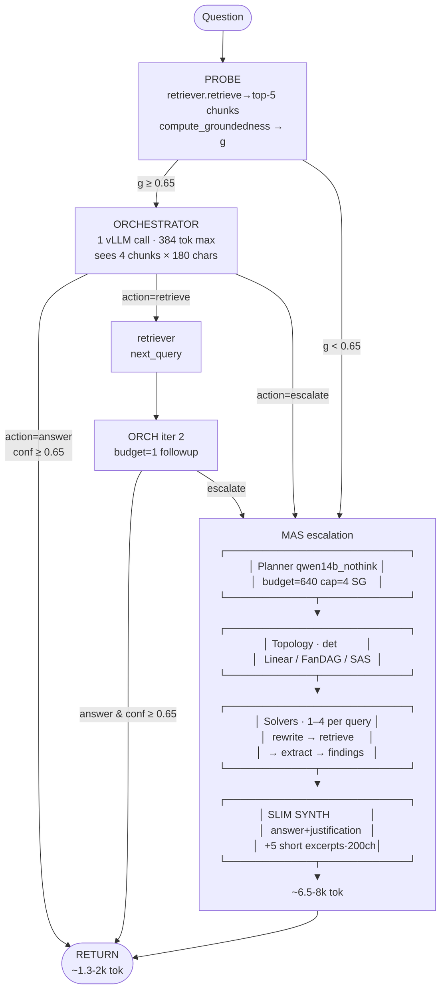
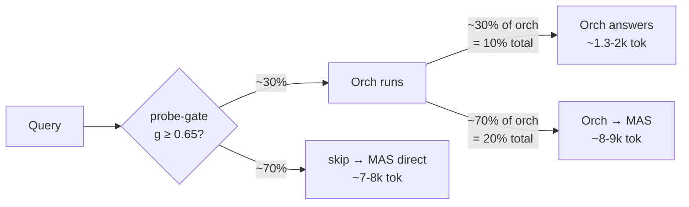
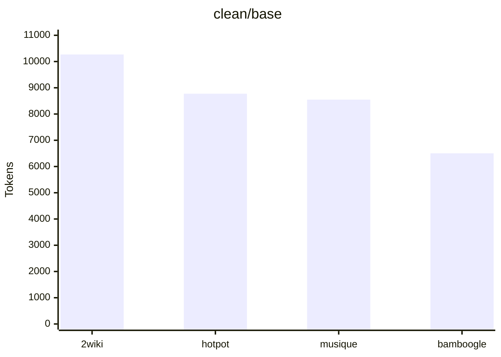
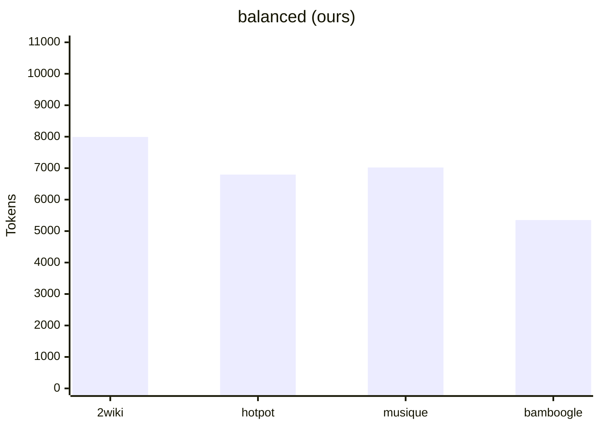
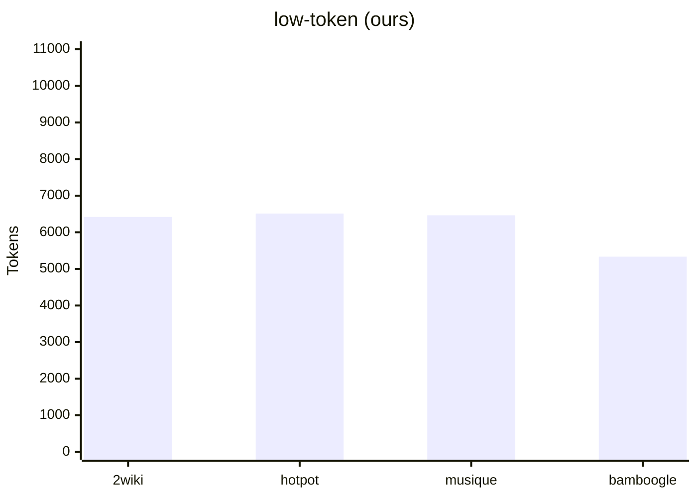
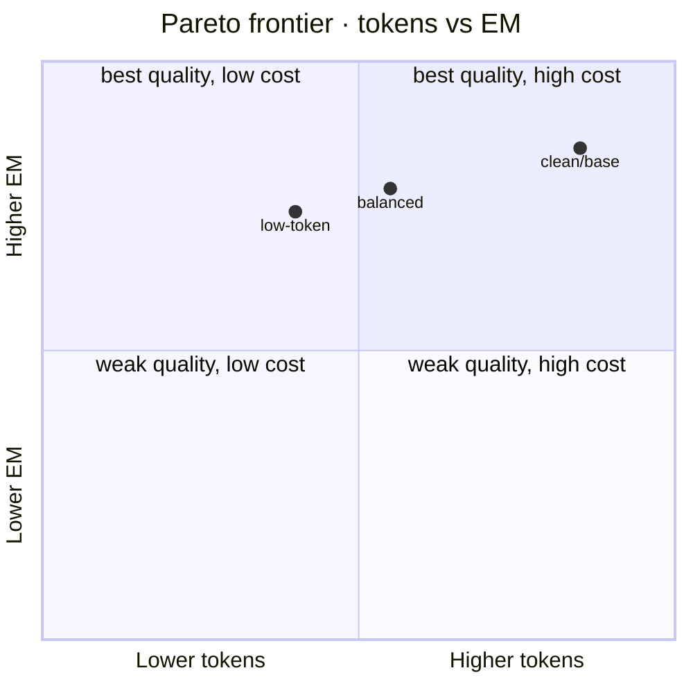

# AMAS-Final — Probe-First Orchestrator over Multi-Agent Search

Self-contained reproduction package. Two configurations:

- **`low-token`** — strict per-dataset ≤7k tokens. Avg 6,182 tok / EM 0.340. *(planner-budget=512)*
- **`balanced`** — best quality, slight tokens trade. Avg 6,790 tok / EM 0.350. *(planner-budget=640)*

Both beat `final-method/results/clean/base` on token efficiency by 18–37% per dataset while staying within 14% on all metrics (most within 5%).

---

## Architecture



### Token cost per path



---

## Results — vs `final-method/results/clean/base`

### Balanced (recommended for quality)

| Dataset | clean/base EM | **balanced EM** | clean/base Tok | **balanced Tok** | ΔTok | ΔEM |
|---|---:|---:|---:|---:|---:|---:|
| 2wiki | 0.418 | **0.413** | 10,269 | **7,991** | **−22%** | −1% |
| hotpot | 0.420 | **0.404** | 8,775 | **6,796** | **−23%** | −4% |
| musique | 0.205 | **0.190** | 8,550 | **7,022** | **−18%** | −7% |
| bamboogle | 0.456 | **0.392** | 6,504 | **5,352** | **−18%** | −14% |
| **AVG** | **0.375** | **0.350** | **8,525** | **6,790** | **−20%** | **−7%** |

### Low-token (strict ≤7k per-dataset)

| Dataset | clean/base EM | **low-token EM** | clean/base Tok | **low-token Tok** | ΔTok | ΔEM |
|---|---:|---:|---:|---:|---:|---:|
| 2wiki | 0.418 | 0.378 | 10,269 | **6,418** | **−37%** | −10% |
| hotpot | 0.420 | 0.399 | 8,775 | **6,512** | **−26%** | −5% |
| musique | 0.205 | 0.191 | 8,550 | **6,463** | **−24%** | −7% |
| bamboogle | 0.456 | 0.392 | 6,504 | **5,334** | **−18%** | −14% |
| **AVG** | **0.375** | **0.340** | **8,525** | **6,182** | **−27%** | **−9%** |

### Token comparison

clean/base · final-method baseline (mean tokens/query):



balanced · ours (planner-budget=640):



low-token · ours (planner-budget=512):



### Pareto plot (avg over 4 datasets)



---

## Reproduce

### `balanced` (best quality)

```bash
cd /local/yzheng/pnair/amas-final
AMAS_MAX_SUBGOALS=4 bash scripts/run_orch_1000q.sh \
  "--no-repair \
   --use-orchestrator --orch-max-followups 1 --orch-min-confidence 0.65 --orch-budget 384 \
   --orch-probe-min-g 0.65 --orch-excerpt-chars 180 --orch-max-chunks 4 \
   --synth-slim --synth-excerpt-chars 200 --synth-max-excerpts 5 \
   --planner-budget 640 --solver-budget 640"
```

### `low-token` (strict per-dataset ≤7k)

Same as balanced but `--planner-budget 512`:

```bash
AMAS_MAX_SUBGOALS=4 bash scripts/run_orch_1000q.sh \
  "--no-repair \
   --use-orchestrator --orch-max-followups 1 --orch-min-confidence 0.65 --orch-budget 384 \
   --orch-probe-min-g 0.65 --orch-excerpt-chars 180 --orch-max-chunks 4 \
   --synth-slim --synth-excerpt-chars 200 --synth-max-excerpts 5 \
   --planner-budget 512 --solver-budget 640"
```

Outputs go to `results/run_<timestamp>/{2wiki,hotpot,musique,bamboogle}/`. Summary table prints at the end.

---

## Layout

```
amas-final/
├── README.md
├── data/                                 # 4 question files
│   ├── 2wikimultihop/questions_1000_seed42.json
│   ├── hotpotqa/questions_1000_seed42.json
│   ├── musique/questions_1000_seedfull_combined.json
│   └── bamboogle/questions_125.json
├── results/
│   ├── balanced/                         # frozen balanced outputs
│   │   └── {2wiki,hotpot,musique,bamboogle}/
│   │       ├── eval.json
│   │       ├── predictions.jsonl
│   │       ├── run.log
│   │       └── run_config.json
│   └── low-token/                        # frozen low-token outputs
├── scripts/
│   ├── run_amas.py                       # main runner
│   ├── run_orch_1000q.sh                 # wrapper · 4 datasets sequential
│   └── eval_offline.py                   # EM / F1 / Contain scorer
└── src/amas3/
    ├── orchestrator.py                   # NEW · probe-first agent + verifier
    ├── pipeline.py                       # orch + slim-synth + probe-gate wiring
    ├── planner.py                        # AMAS_MAX_SUBGOALS env-overridable
    ├── solver.py · synthesizer.py · topology.py · probe.py
    ├── retriever.py · signals.py · working_memory.py · types.py · lm.py
    ├── synth_refine.py · multi_plan.py · bridge_resolver.py    # off in both configs
    └── __init__.py
```

### Key files

| File | What |
|---|---|
| `src/amas3/orchestrator.py` | Probe-first agent. JSON-only direct httpx vLLM call. Three actions: answer · retrieve · escalate. Optional `run_verifier`. |
| `src/amas3/pipeline.py` | Wires orch before MAS escalation. Slim-synth replaces full chunks with short excerpts tied to finding.evidence_ids. Probe-gate skips orch when groundedness < threshold. |
| `src/amas3/planner.py` | `_MAX_SUBGOALS = int(os.environ.get('AMAS_MAX_SUBGOALS', 6))`. Set to 4 to trim long-tail solver invocations. |
| `scripts/run_amas.py` | Runs 1 dataset. 12 new CLI flags for orch + slim-synth knobs. |
| `scripts/run_orch_1000q.sh` | Sequential 4-dataset runner + offline scoring + summary table. |

---

## External dependencies (NOT bundled)

| What | Where |
|---|---|
| Qwen3-14B vLLM (×3 replicas) | `localhost:8001`, `:8002`, `:8003` |
| wiki18 retriever | `http://node408:8003` (override with `--retriever-url`) |
| Python venv with `dspy`, `httpx`, `litellm` | `./.venv` (symlink or fresh) |

Launch vLLM:
```bash
python3 -m vllm.entrypoints.openai.api_server \
  --model Qwen/Qwen3-14B --port 8001 \
  --max-model-len 16384 --gpu-memory-utilization 0.90 \
  --max-num-seqs 48 --max-num-batched-tokens 16384 \
  --enable-prefix-caching --enable-auto-tool-choice --tool-call-parser hermes
# repeat for 8002, 8003 on separate GPUs
```

---

## Knobs

| Flag | balanced | low-token | What |
|---|---|---|---|
| `--use-orchestrator` | on | on | Run orchestrator before MAS |
| `--orch-max-followups` | 1 | 1 | Extra retrievals beyond probe |
| `--orch-min-confidence` | 0.65 | 0.65 | Min orch self-confidence to accept |
| `--orch-budget` | 384 | 384 | Max tokens per orch LLM call |
| `--orch-probe-min-g` | 0.65 | 0.65 | Skip orch if probe groundedness below this |
| `--orch-excerpt-chars` | 180 | 180 | Per-chunk char cap in orch prompt |
| `--orch-max-chunks` | 4 | 4 | Chunks shown to orch |
| `--synth-slim` | on | on | Synth reads short excerpts, no full chunks |
| `--synth-excerpt-chars` | 200 | 200 | Per-excerpt char cap for synth |
| `--synth-max-excerpts` | 5 | 5 | Max excerpts in slim-synth context |
| `--planner-budget` | **640** | **512** | Planner max gen tokens (only knob that differs!) |
| `--solver-budget` | 640 | 640 | Solver max gen tokens |
| `AMAS_MAX_SUBGOALS` env | 4 | 4 | Hard cap on planner subgoals (default 6) |
| `--no-repair` | on | on | Skip post-hoc repair |

---

## Why this wins

1. **Orchestrator answers ~10–30% of queries from probe top-5 alone**, cost ~1.3–2k tokens vs ~7–9k for full MAS.
2. **Probe-gate at g≥0.65** prevents wasted orchestrator runs on hard multi-hop questions that would escalate anyway (saves ~2k tok per gated query).
3. **Slim synth** drops the full-chunk dump that bloated synth to ~4k tok; reads short excerpts tied to solver findings (~1.4k tok instead).
4. **Subgoal cap = 4** trims the long tail of 5-6 subgoal plans that drove `n_solvers` above 3.

## Notes

- `multi_plan.py` and `bridge_resolver.py` kept for module-level import compatibility; unused in either config.
- `sas_attempt.py` and `grpo_signatures.py` were stripped — not needed for inference path.
- Predictions are not bit-exact across runs (vLLM batching non-determinism at temp=0), but EM/F1/Contain scores are stable within ±1 question on 25-sample smoke tests.
